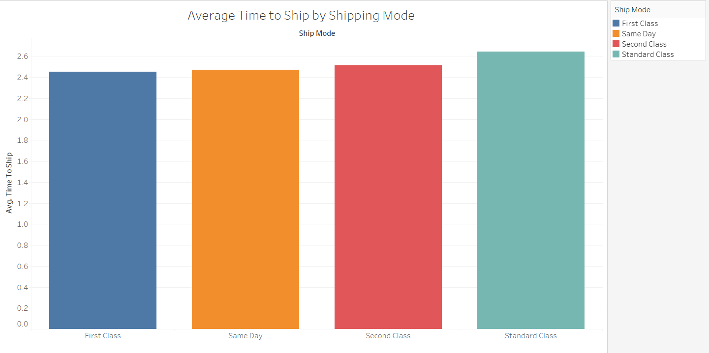
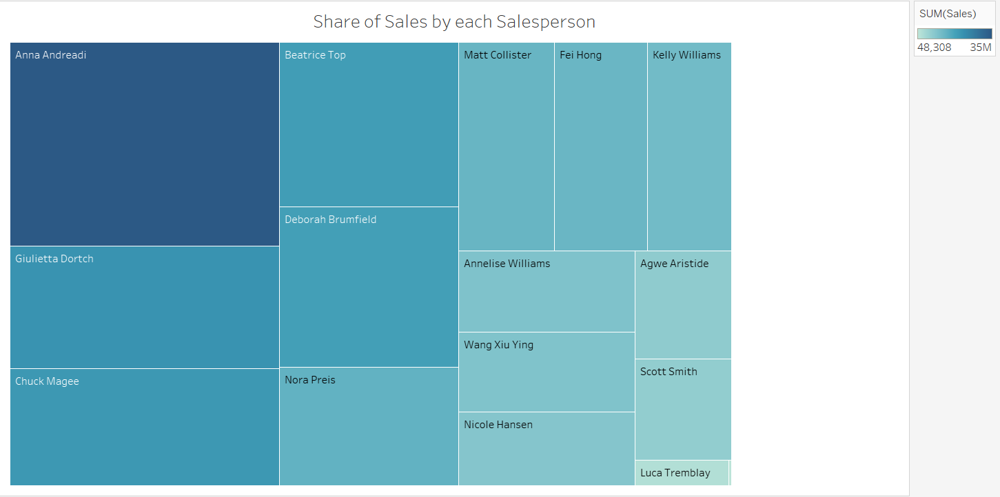
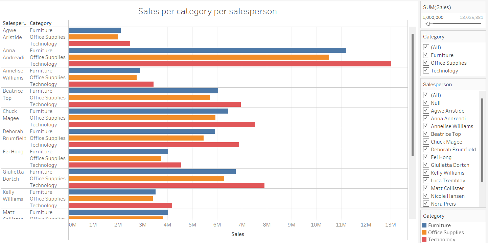

# Project-3-Tableau

## Description
This repository contains a simple Tableau project designed to showcase data visualization techniques using Tableau. The project includes a sample dataset and a Tableau workbook with various visualizations.

## Contents
- `dataple_data.csv`: The sample dataset used for the Tableau visualizations.
- `tabdashboard.twbx`: The Tableau workbook containing the visualizations.

## Visualizations
The Tableau workbook includes the following visualizations:

